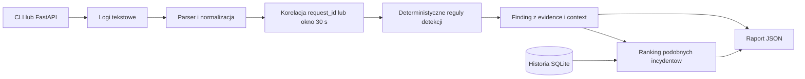

# Incident Triage Copilot

Incident Triage Copilot zamienia tekstowe logi aplikacyjne w uporzadkowany raport wstepnej diagnozy incydentu.

Narzedzie koreluje powiazane wpisy po `request_id` lub czasie, rozpoznaje obslugiwane typy awarii, pokazuje dokladne linie logu bedace dowodem i proponuje kolejne kroki diagnostyczne.

Nie zastepuje analizy inzyniera i nie wykonuje automatycznej naprawy. Automatyzuje pierwszy, powtarzalny etap triage'u.

Najwazniejsza zasada: kazdy wniosek musi miec dowody w konkretnych, niezmodyfikowanych liniach logu. Aplikacja nie zgaduje przyczyny bez evidence.

Projekt nie uzywa LLM, embeddingow, PostgreSQL, SQLAlchemy, frontendu ani uwierzytelniania.

## Spis treści

- [Jak to działa w praktyce](#jak-to-działa-w-praktyce)
- [Cel MVP](#cel-mvp)
- [Aktualny zakres](#aktualny-zakres)
- [Wymagania](#wymagania)
- [Instalacja lokalna](#instalacja-lokalna)
- [CLI](#cli)
- [API](#api)
- [Request ID i logowanie](#request-id-i-logowanie)
- [Kontrakt raportu JSON](#kontrakt-raportu-json)
- [Fixture'y](#fixturey)
- [SQLite](#sqlite)
- [Quality gates](#quality-gates)
- [Docker](#docker)
- [Docker Compose](#docker-compose)
- [CI](#ci)
- [Struktura projektu](#struktura-projektu)
- [Roadmap](#roadmap)
- [Ograniczenia](#ograniczenia)

## Jak to działa w praktyce

### Przepływ analizy



Podstawowa analiza działa bez bazy danych. SQLite jest używane tylko do przechowywania rozwiązanych incydentów i wyszukiwania podobnych przypadków.

### Przykładowy incydent

Klient próbuje wykonać płatność, ale aplikacja zwraca błąd. Operator lub inżynier supportu otrzymuje log i chce szybko sprawdzić, czy problem dotyczy aplikacji, bazy danych, autoryzacji czy zewnętrznego API. Incident Triage Copilot pomaga przygotować wstępną diagnozę na podstawie dostępnych wpisów, ale nie jest kompletnym systemem produkcyjnym ani narzędziem automatycznej naprawy.

### Log wejściowy

```text
2026-07-15T09:14:02Z INFO request_id=abc-1 user=zażółć start checkout submit
2026-07-15T09:14:05Z ERROR request_id=abc-1 upstream payment API timed out after 3000ms endpoint=https://payments.example.test/v1/charge
2026-07-15T09:14:05Z INFO request_id=abc-1 response_status=502
```

### Uruchomienie

```powershell
incident-triage analyze fixtures/api_timeout.log
```

### Najważniejsza część wyniku

Poniżej znajduje się skrócony fragment rzeczywistej odpowiedzi CLI.

```json
{
  "status": "incidents_detected",
  "findings": [
    {
      "incident_type": "external_api_timeout",
      "symptom": "Timeout while calling an external API or upstream HTTP service.",
      "probable_cause": "The external API or upstream HTTP service did not respond before the configured timeout.",
      "confidence": 0.9,
      "correlation": {
        "strategy": "request_id",
        "key": "abc-1",
        "window_seconds": null,
        "source_count": 1
      },
      "evidence": [
        {
          "source_name": "fixtures/api_timeout.log",
          "line_number": 2,
          "text": "2026-07-15T09:14:05Z ERROR request_id=abc-1 upstream payment API timed out after 3000ms endpoint=https://payments.example.test/v1/charge"
        }
      ],
      "context": [
        {
          "source_name": "fixtures/api_timeout.log",
          "line_number": 1,
          "text": "2026-07-15T09:14:02Z INFO request_id=abc-1 user=zażółć start checkout submit"
        },
        {
          "source_name": "fixtures/api_timeout.log",
          "line_number": 3,
          "text": "2026-07-15T09:14:05Z INFO request_id=abc-1 response_status=502"
        }
      ],
      "recommended_actions": [
        "Check the referenced upstream API endpoint and provider status.",
        "Inspect client timeout settings and retry behavior for the affected request.",
        "Correlate this line with surrounding request identifiers before changing production settings."
      ]
    }
  ]
}
```

### Co aplikacja ustaliła

- Wykryto timeout zewnętrznego API.
- Powiązane wpisy połączono przez `request_id=abc-1`.
- Dokładna linia timeoutu została wskazana jako `evidence`.
- Status HTTP `502` został dołączony jako `context`.
- Aplikacja zaproponowała kolejne kroki diagnostyczne; jest to wstępna diagnoza, czyli najbardziej prawdopodobne wyjaśnienie według reguły.

### Co to daje operatorowi

Bez narzędzia operator musiałby ręcznie przeszukać log, znaleźć powiązane wpisy, połączyć je po identyfikatorze requestu, sklasyfikować typ awarii i przygotować podstawowe podsumowanie incydentu. Z narzędziem otrzymuje od razu uporządkowane podsumowanie, klasyfikację problemu, dokładne linie dowodowe, kontekst requestu i listę kolejnych czynności diagnostycznych.

logi -> normalizacja -> korelacja -> wykrycie reguły -> raport z dowodami

[↑ Powrót do spisu treści](#spis-treści)

---

## Cel MVP

MVP analizuje niestrukturyzowane logi tekstowe, rozpoznaje obslugiwane scenariusze incydentow, laczy zdarzenia w wielu zrodlach przez `request_id` lub okno czasowe i zwraca raport JSON. Historia rozwiazanych incydentow jest opcjonalna i zapisywana lokalnie w SQLite.

[↑ Powrót do spisu treści](#spis-treści)

---

## Aktualny zakres

- CLI: `python triage.py ...` oraz instalowalna komenda `incident-triage`.
- API HTTP: FastAPI z `/health`, `/ready`, `/v1/analyze`, `/v1/analyze-bundle`, `/v1/history`.
- Analiza pojedynczego logu i paczki plikow `.log`.
- SQLite dla historii rozwiazanych incydentow i podobnych incydentow.
- Strukturalne logowanie requestow API jako pojedyncze rekordy JSON na stdout.
- Middleware `X-Request-ID`.
- Dockerfile, Docker Compose i workflow GitHub Actions.

Obslugiwane scenariusze wykrywania:

- timeout zewnetrznego API,
- blad polaczenia z baza,
- nieudana autoryzacja.

[↑ Powrót do spisu treści](#spis-treści)

---

## Wymagania

### Runtime

- Python 3.12 lub nowszy,
- zaleznosci instalowane automatycznie z `pyproject.toml`,
- opcjonalnie Docker i Docker Compose.

### Development

- zaleznosci z grupy `.[dev]`,
- pytest,
- pytest-cov,
- Ruff,
- mypy,
- build,
- httpx2.

`pyproject.toml` pozostaje zrodlem prawdy dla zaleznosci i ich wersji.

[↑ Powrót do spisu treści](#spis-treści)

---

## Instalacja lokalna

```powershell
python -m venv .venv
.\.venv\Scripts\Activate.ps1
python -m pip install -e ".[dev]"
```

Instalacja bez zaleznosci developerskich:

```powershell
python -m pip install -e .
```

[↑ Powrót do spisu treści](#spis-treści)

---

## CLI

```powershell
python triage.py fixtures/api_timeout.log
python triage.py analyze fixtures/api_timeout.log
python triage.py analyze-bundle fixtures/bundle
python triage.py history list --db data/incidents.db
```

Po instalacji pakietu dziala ten sam CLI jako entry point:

```powershell
incident-triage fixtures/api_timeout.log
incident-triage analyze fixtures/api_timeout.log
incident-triage analyze-bundle fixtures/bundle
incident-triage history list --db data/incidents.db
incident-triage --version
```

`triage.py` pozostaje cienkim adapterem do `incident_triage.cli:main`; logika CLI nie jest duplikowana.

[↑ Powrót do spisu treści](#spis-treści)

---

## API

Uruchomienie lokalne bez historii:

```powershell
.\.venv\Scripts\python.exe -m uvicorn incident_triage.api:app --reload
```

Uruchomienie z historia SQLite:

```powershell
$env:INCIDENT_TRIAGE_DB = "data/incidents.db"
.\.venv\Scripts\python.exe -m uvicorn incident_triage.api:app --reload
```

Endpointy:

- `GET /health` - sprawdza tylko proces aplikacji i nie tworzy bazy,
- `GET /ready` - sprawdza gotowosc storage, jezeli historia jest skonfigurowana,
- `POST /v1/analyze`,
- `POST /v1/analyze-bundle`,
- `POST /v1/history`,
- `GET /v1/history`,
- `GET /v1/history/{incident_id}`.

`/health` zwraca `service_version`, ktora pochodzi z centralnej wersji aplikacji `0.6.1`.

Projekt rozroznia cztery wersje:

- wersja aplikacji: `0.6.1`,
- publiczny `schema_version` raportow i historii: `0.4`,
- `api_version`: `1`,
- wersja schematu SQLite: `1`.

OpenAPI jest dostepne pod:

- `/docs`,
- `/openapi.json`.

[↑ Powrót do spisu treści](#spis-treści)

---

## Request ID i logowanie

API akceptuje opcjonalny naglowek `X-Request-ID`. Poprawna wartosc ma 1-128 znakow i moze zawierac litery, cyfry, `-`, `_`, `.`. Brak lub niepoprawna wartosc jest zastepowana UUID. Odpowiedz zawsze zawiera `X-Request-ID`.

Kontrolowane bledy API zawieraja `request_id`:

```json
{
  "error": {
    "code": "invalid_request",
    "message": "Invalid request.",
    "details": null,
    "request_id": "..."
  }
}
```

Kazdy request API zapisuje jeden rekord JSON na stdout:

```json
{
  "duration_ms": 1.23,
  "event": "http_request_completed",
  "method": "POST",
  "path": "/v1/analyze",
  "request_id": "demo-1",
  "status_code": 200
}
```

Log requestu nie zawiera body, evidence, context, tokenow ani surowych bledow SQLite.

[↑ Powrót do spisu treści](#spis-treści)

---

## Kontrakt raportu JSON

Aktualny `schema_version` publicznych odpowiedzi analizy i historii to `0.4`.

```json
{
  "schema_version": "0.4",
  "analysis_mode": "single",
  "sources": [
    {
      "source_name": "fixtures/api_timeout.log",
      "line_count": 4
    }
  ],
  "status": "incidents_detected",
  "summary": {
    "source_count": 1,
    "findings_count": 1,
    "incident_types": ["external_api_timeout"]
  },
  "findings": [
    {
      "incident_type": "external_api_timeout",
      "symptom": "Timeout while calling an external API or upstream HTTP service.",
      "probable_cause": "The external API or upstream HTTP service did not respond before the configured timeout.",
      "evidence": [
        {
          "source_name": "fixtures/api_timeout.log",
          "line_number": 2,
          "text": "2026-07-15T09:14:05Z ERROR request_id=abc-1 upstream payment API timed out after 3000ms endpoint=https://payments.example.test/v1/charge"
        }
      ],
      "context": [],
      "recommended_actions": [
        "Check the referenced upstream API endpoint and provider status."
      ],
      "confidence": 0.9,
      "correlation": {
        "strategy": "request_id",
        "key": "abc-1",
        "window_seconds": null,
        "source_count": 1
      },
      "similar_incidents": []
    }
  ]
}
```

Kazdy element `evidence` i `context` zawiera:

```json
{
  "source_name": "worker.log",
  "line_number": 1,
  "text": "dokladna, niezmodyfikowana linia logu"
}
```

Brak rozpoznanego incydentu zwraca `status: "no_incident_detected"`, puste `findings` i nie wymysla przyczyny ani dowodow.

[↑ Powrót do spisu treści](#spis-treści)

---

## Fixture'y

Przyklady uzytkowe sa w `fixtures/`:

- `api_timeout.log`,
- `database_connection_error.log`,
- `authorization_failure.log`,
- `mixed.log`,
- `unknown_incident.log`,
- `bundle/` z wieloma zrodlami do analizy paczki.

Testy korzystaja z tych samych plikow.

[↑ Powrót do spisu treści](#spis-treści)

---

## SQLite

Historia jest opcjonalna. Po ustawieniu `INCIDENT_TRIAGE_DB` lub `--db` aplikacja uzywa lokalnej bazy SQLite. Polaczenia wlaczaja `foreign_keys`, `busy_timeout`, `row_factory`, a zapisywalna baza jest inicjalizowana w trybie WAL. Nie ma globalnego polaczenia.

API inicjalizuje schemat SQLite podczas kontrolowanego startupu FastAPI, jezeli historia jest skonfigurowana. Inicjalizacja jest idempotentna i uzywa tej samej warstwy storage co zapis historii. Import modulu API, generowanie OpenAPI oraz `GET /health` nie tworza bazy. `GET /ready` pozostaje operacja tylko do odczytu.

Jezeli historia nie jest skonfigurowana, aplikacja nie tworzy domyslnej bazy: `/health` i `/ready` zwracaja `history_storage = "disabled"`, analiza dziala, a endpointy historii zwracaja kontrolowane `503`.

Jezeli historia jest skonfigurowana na swiezym volume, startup tworzy plik bazy i schemat. Wtedy `/ready` zwraca `200` oraz `{"status": "ready", "history_storage": "available"}`, a `GET /v1/history` zwraca pusta historie.

Bledna konfiguracja storage, na przyklad uszkodzony plik SQLite, nieobslugiwana wersja schematu albo brak mozliwosci utworzenia katalogu bazy, powoduje fail-fast podczas startupu aplikacji. Publiczne odpowiedzi nie ujawniaja pelnej sciezki bazy, surowego bledu SQLite ani tracebacka.

W kontenerze baza jest pod `/data/incidents.db`; trwalosc zapewnia volume.

[↑ Powrót do spisu treści](#spis-treści)

---

## Quality gates

```powershell
.\.venv\Scripts\python.exe -m ruff check .
.\.venv\Scripts\python.exe -m ruff format --check .
.\.venv\Scripts\python.exe -m mypy incident_triage
.\.venv\Scripts\python.exe -m pytest -W error `
  --cov=incident_triage `
  --cov-branch `
  --cov-report=term-missing `
  --cov-fail-under=90
```

Zaleznosci developerskie obejmuja `pytest`, `pytest-cov`, `ruff`, `mypy`, `build` i `httpx2`.

[↑ Powrót do spisu treści](#spis-treści)

---

## Docker

Budowa obrazu:

```powershell
docker build -t incident-triage-copilot:local .
```

Uruchomienie:

```powershell
docker run --rm -p 8000:8000 -v incident-triage-data:/data incident-triage-copilot:local
```

Obraz uzywa oficjalnego Python 3.12 slim, instaluje projekt jako pakiet, nie instaluje zaleznosci developerskich, uruchamia `uvicorn` bez `--reload`, dziala jako uzytkownik non-root i wystawia port `8000`.

[↑ Powrót do spisu treści](#spis-treści)

---

## Docker Compose

```powershell
docker compose up --build
```

`compose.yaml` zawiera jeden serwis API i named volume `incident-triage-data` zamontowany pod `/data`.

[↑ Powrót do spisu treści](#spis-treści)

---

## CI

`.github/workflows/ci.yml` uruchamia sie dla `push` i `pull_request`. Pipeline wykonuje instalacje z zaleznosciami developerskimi, Ruff, format check, mypy, pytest z branch coverage i progiem 90%, a nastepnie buduje obraz Docker. Workflow nie publikuje obrazu i nie wymaga sekretow.

[↑ Powrót do spisu treści](#spis-treści)

---

## Struktura projektu

```text
.
|-- .dockerignore
|-- .github/
|   `-- workflows/
|       `-- ci.yml
|-- Dockerfile
|-- README.md
|-- compose.yaml
|-- fixtures/
|   |-- bundle/
|   |-- api_timeout.log
|   |-- authorization_failure.log
|   |-- database_connection_error.log
|   |-- mixed.log
|   `-- unknown_incident.log
|-- incident_triage/
|   |-- __init__.py
|   |-- analyzer.py
|   |-- api.py
|   |-- cli.py
|   |-- models.py
|   |-- parser.py
|   |-- rules.py
|   |-- service.py
|   |-- similarity.py
|   |-- storage.py
|   `-- versions.py
|-- pyproject.toml
|-- tests/
|   |-- test_analyzer.py
|   |-- test_api.py
|   |-- test_cli.py
|   |-- test_parser.py
|   |-- test_service.py
|   `-- test_storage.py
`-- triage.py
```

[↑ Powrót do spisu treści](#spis-treści)

---

## Roadmap

- wiecej formatow i regul normalizacji logow,
- rozbudowane reguly korelacji,
- opcjonalny backend PostgreSQL,
- uwierzytelnianie API,
- opcjonalna warstwa LLM dzialajaca wylacznie na evidence,
- obserwowalnosc przez OpenTelemetry lub Prometheus.

Roadmapa opisuje przyszle kierunki, nie funkcje ukonczone ani konkretne wersje.

[↑ Powrót do spisu treści](#spis-treści)

---

## Ograniczenia

- Brak LLM i embeddingow.
- Brak PostgreSQL.
- Brak SQLAlchemy.
- Brak frontendu.
- Brak uwierzytelniania.
- Brak Redis, Celery, Kubernetes, reverse proxy i TLS.
- Brak zewnetrznego systemu logowania, Prometheusa i OpenTelemetry.
- Brak automatycznego deploymentu.
- Brak multipart upload.
- Brak streamingu i obserwowania katalogu.
- Brak rekurencyjnego skanowania bundle.
- Brak zapisu calej paczki bundle do historii jednym poleceniem.

[↑ Powrót do spisu treści](#spis-treści)
